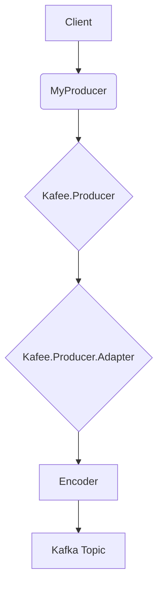
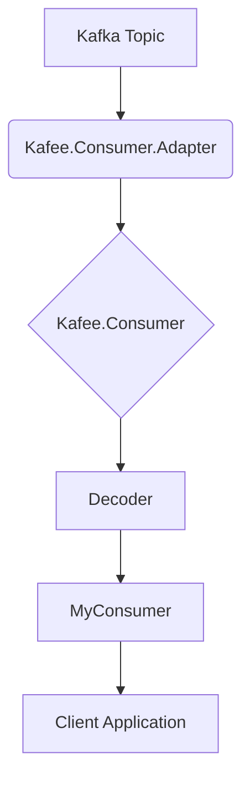
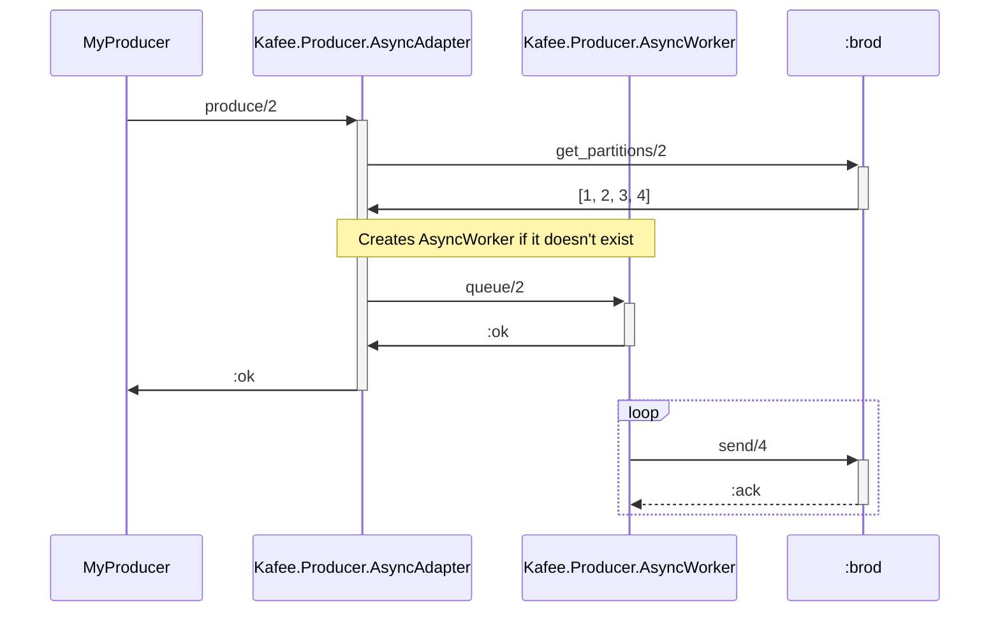
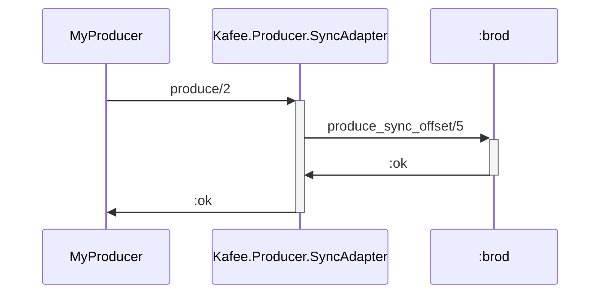
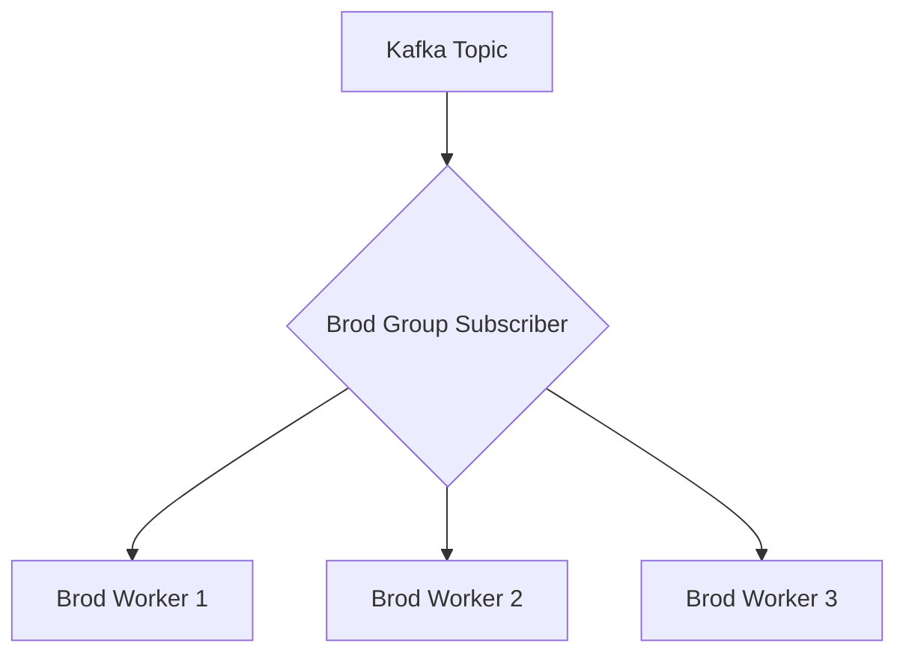
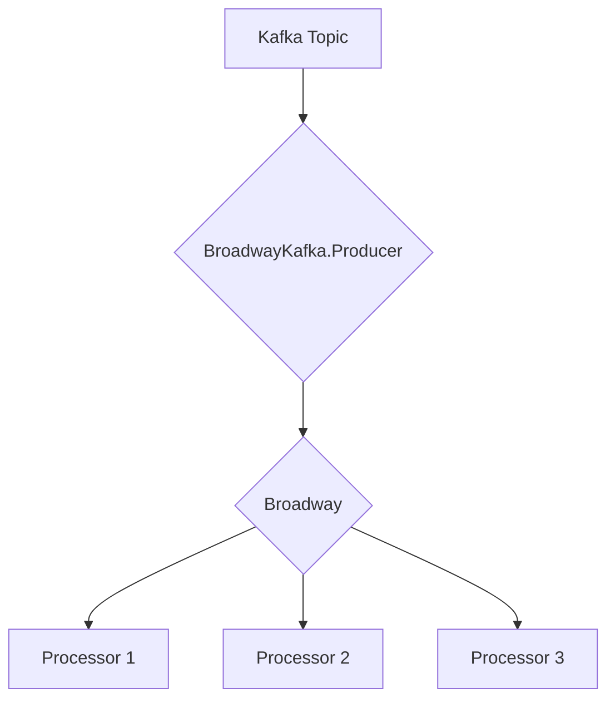

# Kafee Architecture

This document outlines the architecture of the Kafee library, an Elixir-based Kafka client that provides a flexible and extensible framework for producing and consuming Kafka messages.

## Core Concepts

Kafee is built around a few core concepts:

- **Producers:** Responsible for sending messages to Kafka topics.
- **Consumers:** Responsible for receiving messages from Kafka topics.
- **Adapters:** Pluggable modules that provide different strategies for producing and consuming messages.
- **Encoder/Decoders:** Modules that handle the serialization and deserialization of message payloads.

## Data Flows

### Message Production

The following diagram illustrates the data flow when a client produces a message to a Kafka topic:

1.  The client calls a function on a producer module (e.g., `MyProducer.publish/2`).
2.  The producer module calls the `Kafee.Producer.produce/2` function, which in turn calls the configured adapter.
3.  The adapter uses the configured encoder to serialize the message payload.
4.  The adapter sends the message to the Kafka topic.

### Message Consumption

The following diagram illustrates the data flow when a client consumes a message from a Kafka topic:

1.  The consumer adapter receives a message from a Kafka topic.
2.  The adapter calls the `Kafee.Consumer.handle_message/1` function, which in turn calls the configured decoder.
3.  The decoder deserializes the message payload.
4.  The `handle_message/1` function in the consumer module is called with the decoded message.
5.  The client application processes the message.

## Producer Adapters

Kafee provides three producer adapters out of the box:

- `Kafee.Producer.AsyncAdapter`: Sends messages asynchronously in the background.
- `Kafee.Producer.SyncAdapter`: Sends messages synchronously and blocks until the message is acknowledged by Kafka.
- `Kafee.Producer.TestAdapter`: A test adapter that captures messages in memory for inspection during tests.

### Async Adapter

The `AsyncAdapter` uses a `GenServer` to queue messages and send them to Kafka in batches. This provides high throughput but does not guarantee that messages will be sent in the order they were produced.

### Sync Adapter

The `SyncAdapter` sends messages synchronously using the `:brod.produce_sync_offset/5` function. This guarantees that messages will be sent to Kafka in the order they were produced, but it has lower throughput than the `AsyncAdapter`.

## Consumer Adapters

Kafee provides two consumer adapters:

- `Kafee.Consumer.BrodAdapter`: Uses `:brod` to fetch messages from Kafka.
- `Kafee.Consumer.BroadwayAdapter`: Uses `Broadway` to process messages from Kafka.

### Brod Adapter

The `BrodAdapter` uses the `:brod_group_subscriber_v2` behavior to consume messages from Kafka. It starts a `GenServer` for each partition of a topic, which allows for concurrent message processing.

### Broadway Adapter

The `BroadwayAdapter` uses the `Broadway` library to process messages from Kafka. `Broadway` provides a high-level API for building data processing pipelines, and it can be used to build complex message processing workflows.

## Encoder/Decoders

Kafee provides three encoder/decoders:

- `Kafee.JasonEncoderDecoder`: Encodes and decodes messages using the `Jason` library.
- `Kafee.ProtobufEncoderDecoder`: Encodes and decodes messages using the `Protobuf` library.
- `Kafee.ProtobufJsonEncoderDecoder`: Encodes and decodes messages using the `Protobuf` library with JSON encoding.
